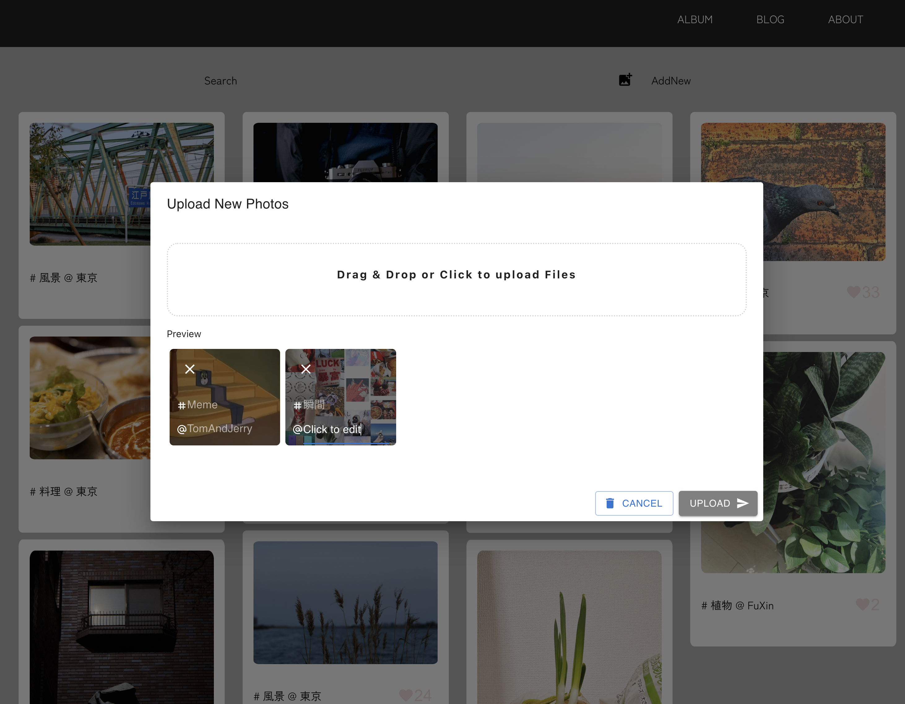

A **React/Material UI + Express + mongoDB** Cloud based Album Application :)

Working on it!

## Introduction

- Frontend: Single page application with React.js and Material UI.
- Backend: Express based APIs. Get data from MongoDB Cloud.
- DB: MongoDB Cloud, Saving info and urls of all photos of the Album.

It's now like this:


And this:



But eventually I hope it would be like Pinteres* or something.

Working on it!

*Btw I took that photos myself LOL.*

## Install

1. Clone or download this repo to local.
2. Install packages.
```
  $cd api
  $npm install
  $cd ../client
  $npm install
```
3. Create your own mongoDB data and write uri into a file such as 
./api/db.js
```
  const uri = "mongodb+srv://【YOUR OWN DB 】.mympmgf.mongodb.net/";

module.exports = {
  uri: uri,
};
```
4. Run the application.
```
  $cd api
  $npm start
  $cd ../client
  $npm start
```
5. Hello World! at localhost:3000

## RoadMap

### Todo
- auth (or maybe user login?) when uploading new photos
- download photos of original size 
- other features incoming...
- styling

### Working on it

- search photos with tag or location

### Done
- MongoDB Cloud setup
- get photos from DB
- fetch photos' data from frontend
- display photos with *simplest* Masonry Layout
- display info of each photo
- kudo(like) button and save realtime data into DB
- upload new photos and save its data into DB.
  - Drag and Drop && click file uploader at frontend
  - Preview of photos to upload
  - Edit tag and location of photos to upload
  - upload and save to DB